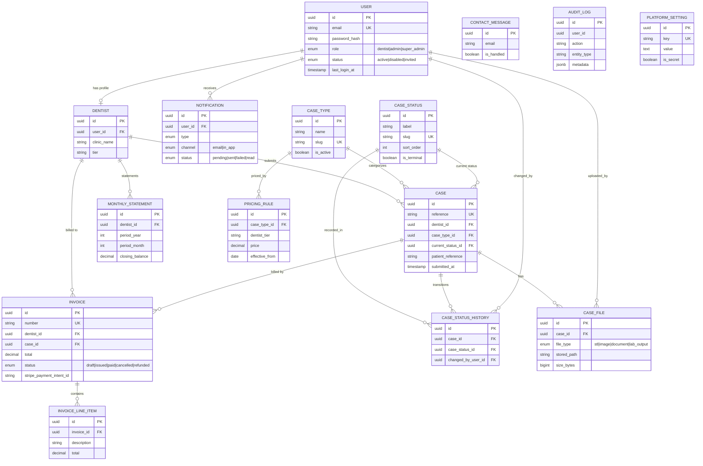

# Entity-Relationship Diagram

Data model for the Dental Laboratory Management Platform (15 entities). All
tables use UUID primary keys and `created_at` / `updated_at` timestamps;
soft-delete (`deleted_at`) is applied where noted in the entities.

